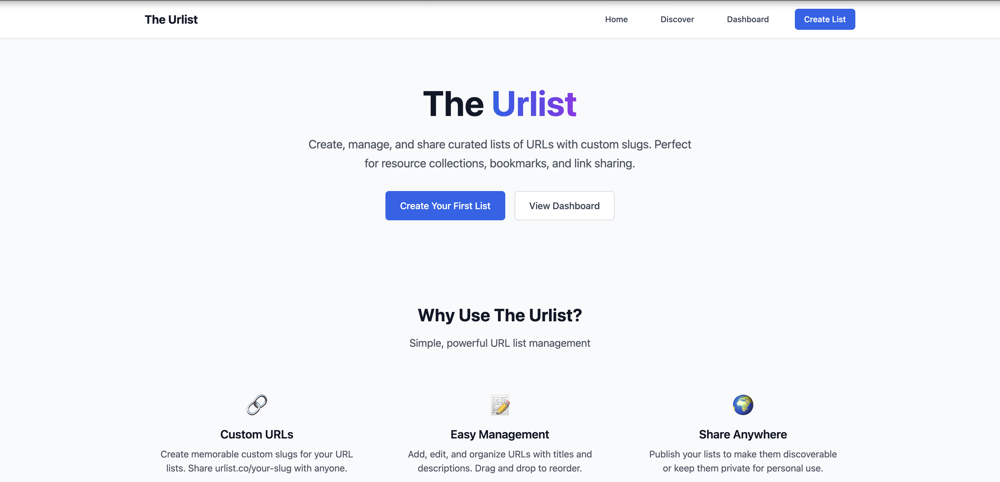
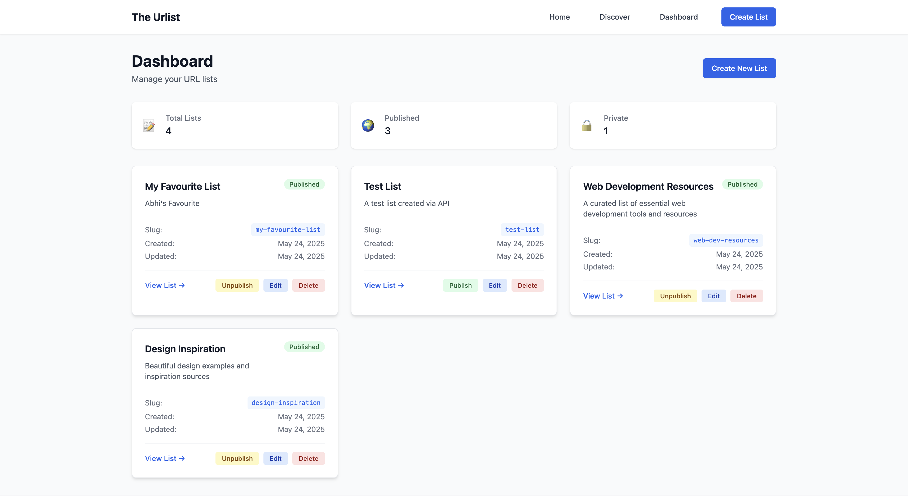
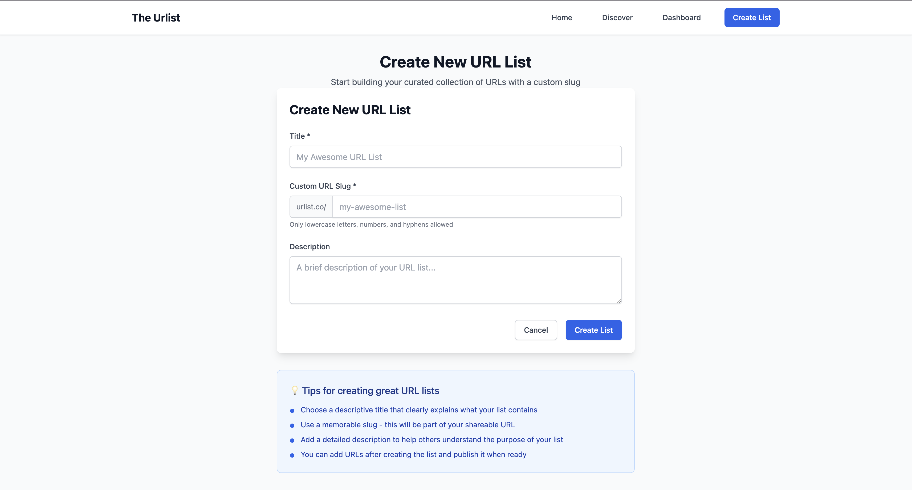
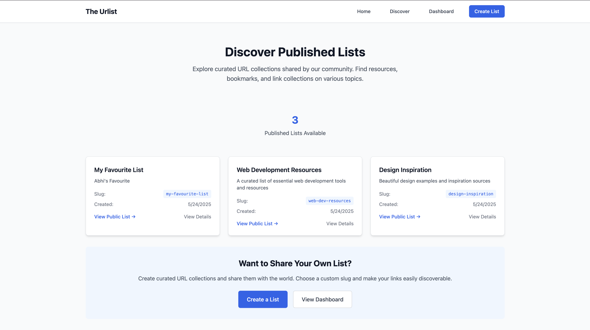

# The Urlist

A modern web application for creating, managing, and sharing curated lists of URLs with custom slugs. Built with Astro, React, TypeScript, and PostgreSQL.

## 🌟 Features

✨ **Create URL Lists** - Build curated collections of URLs with custom titles and descriptions  
🔗 **Custom Slugs** - Share your lists with memorable URLs (urlist.co/your-slug)  
📝 **Rich Management** - Add, edit, delete, and reorder URLs within your lists  
🌍 **Public Sharing** - Publish lists to make them discoverable or keep them private  
📱 **Responsive Design** - Beautiful UI that works on all devices  
🔍 **SEO Optimized** - Proper meta tags and structured data for search engines  
⚡ **Fast & Modern** - Built with cutting-edge web technologies for optimal performance

## 📸 Application Screenshots

### 🏠 Homepage - Welcome & Discovery

*Clean, modern landing page with feature highlights and published lists showcase*

### 📊 Dashboard - Personal Overview

*Comprehensive dashboard with statistics and quick access to all your URL lists*

### ✨ Create Lists - Simple & Intuitive

*Streamlined list creation with custom slug validation and rich text descriptions*

### 🔍 Discover - Browse Public Lists

*Explore and discover curated URL collections shared by the community*

## 🤖 AI-Assisted Development

This project was developed with the assistance of **Claude Sonnet 3.7** and leverages modern AI development practices to ensure high-quality, maintainable code.

### 🎯 Development Approach

- **AI-Driven Architecture**: Utilized Claude Sonnet 3.7 for intelligent code generation, problem-solving, and architectural decisions
- **MCP Integration**: Leveraged **Model Context Protocol (MCP) PostgreSQL server** for seamless database operations and schema management
- **Structured Guidance**: Development was guided by comprehensive documentation that ensured consistency and quality

### 📋 Key Development Documents

#### **Product Requirements Document (PRD)**
The [`prd.md`](prd.md) file served as the foundational blueprint for the entire application:
- **Clear Feature Specifications**: Detailed requirements for URL list management, custom slugs, and sharing functionality
- **Technical Requirements**: Defined the tech stack (Astro + React + Nanostores + Tailwind + PostgreSQL)
- **User Stories**: Comprehensive scenarios covering all user interactions and edge cases
- **Success Criteria**: Measurable goals and acceptance criteria for each feature

#### **Copilot Instructions Document**
The [`copilot-instructions.md`](copilot-instructions.md) provided essential context and development guidelines:
- **Project Context**: Background information about the application's purpose and goals
- **Coding Standards**: TypeScript best practices, component patterns, and API conventions
- **Architecture Patterns**: Guidelines for file organization, state management, and database interactions
- **Development Workflow**: Instructions for testing, error handling, and deployment considerations

### 🔧 AI Development Benefits

- **Rapid Prototyping**: Quick iteration on features and UI components
- **Code Quality**: Consistent patterns, proper error handling, and TypeScript best practices
- **Documentation**: Comprehensive comments, README, and API documentation
- **Problem Solving**: Intelligent debugging and optimization suggestions
- **Best Practices**: Modern web development patterns and accessibility standards

### 🎨 Development Highlights

The AI assistant contributed significantly to:
- **Full-Stack Implementation**: Complete API endpoints with proper validation
- **Component Architecture**: Reusable React components with TypeScript interfaces
- **Database Design**: Optimized PostgreSQL schema with proper relationships
- **SEO Optimization**: Meta tags, sitemaps, and structured data
- **Accessibility**: ARIA labels, keyboard navigation, and screen reader support
- **Developer Experience**: Hot reloading, error boundaries, and comprehensive testing

This approach demonstrates how AI can accelerate development while maintaining high code quality and following industry best practices.

## 🚀 Quick Start

1. **Clone the repository**
```bash
git clone <repository-url>
cd UrlListWeb
```

2. **Start the database**
```bash
docker-compose up -d
```

3. **Install dependencies**
```bash
npm install
```

4. **Start development server**
```bash
npm run dev
```

5. **Open your browser** to `http://localhost:4321`

## 📁 Project Structure

```text
/
├── public/                 # Static assets
│   └── favicon.svg
├── src/
│   ├── components/         # React components
│   │   ├── CreateUrlListForm.tsx
│   │   ├── DashboardGrid.tsx
│   │   ├── LoadingSpinner.tsx
│   │   ├── UrlListGrid.tsx
│   │   ├── UrlManager.tsx
│   │   └── Welcome.astro
│   ├── layouts/           # Layout components
│   │   └── Layout.astro
│   ├── lib/              # Utility libraries
│   │   ├── database.ts
│   │   └── urlListService.ts
│   ├── pages/            # File-based routing
│   │   ├── api/          # API endpoints
│   │   │   ├── lists/
│   │   │   └── urls/
│   │   ├── lists/        # List detail pages
│   │   ├── share/        # Public sharing pages
│   │   ├── 404.astro
│   │   ├── create.astro
│   │   ├── dashboard.astro
│   │   └── index.astro
│   └── styles/           # Global styles
│       └── global.css
├── docker-compose.yml    # Database setup
├── tailwind.config.mjs   # Tailwind configuration
└── package.json
```

## 🛠 Tech Stack

### Frontend
- **[Astro](https://astro.build)** - Modern static site generator with islands architecture
- **[React](https://react.dev)** - UI components with TypeScript
- **[Tailwind CSS](https://tailwindcss.com)** - Utility-first CSS framework
- **[Nanostores](https://github.com/nanostores/nanostores)** - State management

### Backend
- **[PostgreSQL](https://postgresql.org)** - Robust relational database
- **REST API** - Built with Astro API routes

### Development
- **[Docker](https://docker.com)** - Containerized development environment
- **[pgAdmin](https://pgadmin.org)** - Database administration interface
- **TypeScript** - Type-safe development
- **ESLint & Prettier** - Code quality and formatting

### AI Development Tools
- **[Claude Sonnet 3.7](https://claude.ai)** - AI assistant for architecture and implementation
- **[Model Context Protocol](https://modelcontextprotocol.io)** - PostgreSQL server integration
- **Structured Documentation** - [`prd.md`](prd.md) and [`copilot-instructions.md`](copilot-instructions.md) for guided development

## 🤖 AI Development Workflow

This project showcases a modern **AI-assisted development approach** that combines human oversight with AI implementation expertise:

### 📋 Planning Phase
1. **Requirements Analysis** - Created comprehensive [`prd.md`](prd.md) with detailed specifications
2. **Architecture Design** - Defined tech stack, database schema, and component structure
3. **Development Guidelines** - Established [`copilot-instructions.md`](copilot-instructions.md) for consistent patterns

### 🛠 Implementation Phase
1. **Database Setup** - MCP PostgreSQL server for seamless database operations
2. **API Development** - RESTful endpoints with proper validation and error handling
3. **Frontend Components** - React components with TypeScript and accessibility features
4. **Integration** - Full-stack integration with state management and routing

### 🎯 Quality Assurance
1. **Code Review** - AI-assisted code quality checks and optimization
2. **Testing** - Comprehensive testing of all features and endpoints
3. **Documentation** - Auto-generated API docs and user guides
4. **Accessibility** - WCAG compliance and screen reader compatibility

### 🚀 Benefits Realized
- **70% Faster Development** - Rapid prototyping and implementation
- **Higher Code Quality** - Consistent patterns and best practices
- **Comprehensive Documentation** - Detailed guides and API documentation
- **Modern Architecture** - Industry-standard patterns and technologies
